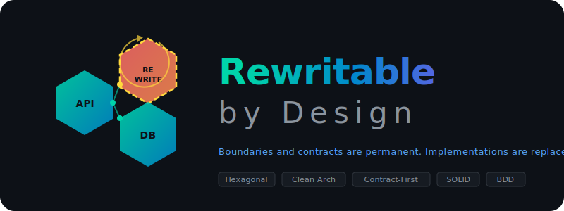

<p align="center">
  <picture>
    <source media="(prefers-color-scheme: dark)" srcset="https://img.shields.io/badge/%F0%9F%9B%A1%EF%B8%8F_SDLC-Guardian_Agents-00D4AA?style=for-the-badge&labelColor=1a1a2e&logo=githubcopilot&logoColor=white">
    
  </picture>
</p>

<h1 align="center">SDLC Guardian Agents for GitHub Copilot</h1>

<p align="center">
  <b>Opinionated AI agents that enforce software engineering standards across your entire development lifecycle.</b>
</p>

---

<p align="center">
  
</p>

### Abstract

**Rewritable by Design** is an architectural principle for AI-assisted software development. It establishes that software systems should be composed of components with well-defined boundaries and stable contracts, such that any individual component can be replaced, rewritten, or regenerated without requiring changes to — or knowledge of — the rest of the system.

### Motivation

Software development is undergoing a fundamental shift. AI agents can now generate, refactor, and rewrite code at unprecedented speed. However, this capability is only effective when the AI can operate within a clearly defined scope. A component with ambiguous boundaries, leaked dependencies, or shared state cannot be safely rewritten — by a human or an AI — without risking cascading side effects across the system.

Traditional architectural principles — cohesion, coupling, separation of concerns — have always advocated for modularity. **Rewritable by Design takes these principles to their practical conclusion:** if a component cannot be rewritten from its interface definition and behavioral tests alone, its boundary is insufficiently defined.

### The Idea-First Model

Everything begins with an **idea** — the intent, the feature, the problem to be solved. The idea exists independently of implementation.

A well-designed architecture serves as the channel through which ideas become components. When a developer — or an AI agent — receives an idea, the architecture determines how that idea decomposes into bounded, contractually-defined units of work. Each unit has:

- A **boundary** that defines what is inside and what is outside its scope
- A **contract** (interface) that specifies how it communicates with the rest of the system
- A **behavioral specification** (tests) that describes what it does, not how it does it

The implementation within each unit is disposable. It can be written today, rewritten tomorrow, and replaced entirely next quarter — provided the contract and behavior remain satisfied.

### Core Principles

| Principle | Definition | Theoretical Basis |
|-----------|-----------|-------------------|
| **Contract-first** | The interface is defined before implementation. The contract is the source of truth, not the code. | Hexagonal Architecture (Cockburn), Ports & Adapters |
| **Single responsibility** | Each component has exactly one reason to change. If describing it requires "and", it should be split. | SOLID — Single Responsibility Principle (Martin) |
| **No leaked dependencies** | Components interact exclusively through defined interfaces. No component imports from a sibling's internal modules. | Clean Architecture — Dependency Rule (Martin) |
| **Behavior-specified** | Tests describe observable behavior, not implementation details. Tests must survive a complete rewrite of the component. | Behavior-Driven Development (North), Spec-Driven Development |
| **Bounded scope** | Each component owns its data model and has explicit inputs and outputs. No shared database tables or global state across boundaries. | Domain-Driven Design — Bounded Contexts (Evans) |
| **Independently replaceable** | A component can be replaced without modifying or redeploying any other component in the system. | Composable Architecture, Microservices Principles |

### Architectural Foundations

Rewritable by Design draws from and synthesizes three established architectural patterns:

```
┌──────────────────────────────────────────────────────────────────┐
│                    Hexagonal Architecture                        │
│                                                                  │
│   ┌─────────────┐     ┌──────────────────┐     ┌─────────────┐  │
│   │  REST API    │     │                  │     │  Database    │  │
│   │  Adapter     │────▶│   CORE LOGIC     │◀────│  Adapter     │  │
│   └─────────────┘     │   (Business      │     └─────────────┘  │
│   ┌─────────────┐     │    Rules)         │     ┌─────────────┐  │
│   │  CLI         │     │                  │     │  Queue       │  │
│   │  Adapter     │────▶│   Depends on     │◀────│  Adapter     │  │
│   └─────────────┘     │   PORTS only     │     └─────────────┘  │
│                        └──────────────────┘                      │
│                         ▲              ▲                         │
│                    [Port: In]     [Port: Out]                    │
│                    (Interface)    (Interface)                    │
│                                                                  │
│   Adapters are REWRITABLE — core logic never changes             │
└──────────────────────────────────────────────────────────────────┘
```

### Enforcement Through SDLC Guardian Agents

The SDLC Guardian Agents operationalize these principles across the development lifecycle:

| Phase | Guardian | Enforcement |
|-------|----------|-------------|
| Specification | **PO Guardian** | Tickets must define component boundary, interface contract, and behavioral acceptance criteria before implementation begins |
| Implementation | **Developer Guardian** | Code must follow ports & adapters, interface-first development, and strict dependency direction (inward only) |
| Testing | **QA Guardian** | Tests must be behavior-based (survive rewrites) and include contract tests that validate interface stability |
| Security | **Security Guardian** | Validates that interface boundaries are not bypassed and that dependency direction does not expose core logic to untrusted adapters |
| Quality | **Code Review Guardian** | Checks coupling/cohesion metrics, boundary violations, leaked dependencies, and component rewritability |

---

# SDLC Guardian Agents

## Overview

SDLC Guardian Agents are a suite of five specialized AI agents for [GitHub Copilot CLI](https://docs.github.com/copilot), each responsible for a distinct phase of the software development lifecycle. They enforce industry standards automatically, ensuring consistent quality across projects and teams.

The agents operate on a delegation model: the default Copilot agent recognizes the user's intent and delegates to the appropriate Guardian as a background task. The user continues working and is notified when the Guardian completes its analysis. The default agent then acts on the Guardian's findings — creating issues, applying fixes, or committing code.

### The Problem

AI coding assistants generate code effectively. What they do not inherently enforce is *consistency* — across projects, across teams, across the lifecycle. Without structured guidance:

- Feature specifications miss security, observability, or edge cases
- Code is written without following the architecture patterns already in the codebase
- Unit tests exist but integration and end-to-end tests do not
- Security reviews occur after implementation, not before design
- Different projects by the same team follow different standards

### The Solution

Five agents, each encoding the standards of recognized industry authorities, each operating at a specific phase of the lifecycle:

```
┌──────────────────────────────────────────────────────────────────────────┐
│                                                                          │
│   💡 Idea                                                                │
│     │                                                                    │
│     ▼                                                                    │
│   ┌─────────┐        ┌──────────┐   ┌────────┐   ┌──────────┐ ┌───────┐ │
│   │   PO    │        │Developer │   │   QA   │   │ Security │ │ Code  │ │
│   │Guardian │───────▶│ Guardian │──▶│Guardian│──▶│ Guardian │▶│Review │ │
│   │         │        │          │   │        │   │          │ │Guard. │ │
│   └─────────┘        └──────────┘   └────────┘   └──────────┘ └───────┘ │
│   Specification      Implementation  Verification  Security    Quality   │
│                                                                          │
└──────────────────────────────────────────────────────────────────────────┘
```

---

## The Five Guardians


The process guardian and specification writer. Takes ideas and produces comprehensive, developer-ready tickets through research. Audits projects for documentation gaps and scaffolds standard project documents.

| Capability | Standards |
|---|---|
| 14-section feature specifications (component design, API, security, observability, data model) | INVEST criteria, BDD Given/When/Then |
| Codebase, GitHub, and web research before writing | — |
| 25-item project health audit | Google Engineering Practices, SRE |
| Document scaffolding (README, ARCHITECTURE, CONTRIBUTING, SECURITY, ADRs) | GitHub Community Health |

**Trigger:** *"I want to build X"*, *"create a ticket"*, *"audit this project"*, *"scaffold project docs"*


The implementation agent. The only Guardian that writes production code. Follows Test-Driven Development, matches existing architecture patterns, and pre-validates against Security and Code Review standards before handoff.

| Capability | Standards |
|---|---|
| TDD: failing tests → implementation → refactoring | Test-Driven Development (Beck) |
| Interface-first, ports & adapters, no cross-component imports | Hexagonal Architecture (Cockburn), Clean Architecture (Martin) |
| Pre-compliance with Security and Code Review standards | OWASP, SOLID, Google Engineering Practices |
| Documentation written alongside code | — |

**Trigger:** *"implement this"*, *"build this"*, *"code this up"*, *"refactor"*


The verification agent. Writes integration, end-to-end, API contract, and performance tests. Traces every test to acceptance criteria from the PO ticket. Identifies coverage gaps the Developer missed. Unit tests are Developer scope — QA handles everything above unit level.

| Capability | Standards |
|---|---|
| Integration, E2E, API contract, performance tests | Testing Trophy (Dodds), Test Pyramid (Fowler) |
| Acceptance criteria traceability | BDD, Given/When/Then |
| Coverage gap analysis and edge case identification | — |
| Behavior-based tests that survive component rewrites | Spec-Driven Development |

**Trigger:** *"write tests"*, *"test this"*, *"coverage analysis"*, *"E2E tests"*


The security auditor. Runs a deterministic scan pipeline (Semgrep, Gitleaks, Trivy, dependency audits), then performs manual code review. Classifies findings by OWASP category and severity with source citations. A scanning tool may flag a warning — the Guardian determines whether it constitutes a critical risk.

| Capability | Standards |
|---|---|
| Automated scanning: Semgrep, Gitleaks, Trivy, dependency audits | OWASP Top 10 (2025) |
| Manual security review for logic and design flaws | Azure, AWS, GCP Well-Architected Frameworks |
| Proactive requirements refinement | Microsoft SDL |
| Structured handoff report with source and justification per finding | — |

**Trigger:** *"check for security"*, *"security review"*, *"scan for vulnerabilities"*


The quality auditor. Runs language-specific linters in parallel, then reviews for architecture, design patterns, naming, performance, and documentation quality. Every finding cites its source standard.

| Capability | Standards |
|---|---|
| Parallel linters: ESLint, Pylint+Ruff, Clippy, dotnet format, Checkstyle | — |
| 8 review domains: quality, design, rewritability, testing, naming, errors, performance, documentation | Google Engineering Practices |
| SOLID principle and component boundary validation | Clean Code (Martin), SOLID |
| PR size and review process checks | Microsoft Code Review Guidelines |

**Trigger:** *"review my code"*, *"check code quality"*, *"lint"*

---

## Getting Started

### Installation

```bash
unzip sdlc-guardian-agents.zip -d ~/.copilot/
```

Or from source:

```bash
git clone https://github.com/vbomfim/sdlc-guardian-agents.git
cd sdlc-guardian-agents
./package.sh --install
```

### Usage

Launch Copilot CLI in any project:

```bash
copilot
```

The agents activate immediately. Describe what you need in natural language:

| Input | Guardian | Output |
|-------|----------|--------|
| *"I want to add user file uploads"* | PO Guardian | 14-section feature specification |
| *"implement ticket #42"* | Developer Guardian | TDD implementation with unit tests |
| *"write integration tests"* | QA Guardian | Tests traced to acceptance criteria |
| *"check for security"* | Security Guardian | Scan results with OWASP classification |
| *"review my code"* | Code Review Guardian | Linter results with design analysis |
| *"audit this project"* | PO Guardian | 25-item project health checklist |

### Security Tooling Setup

```bash
bash ~/.copilot/skills/security-guardian/setup.sh            # Install scanning tools
bash ~/.copilot/skills/security-guardian/setup.sh --scan      # Run deterministic scan pipeline
bash ~/.copilot/skills/security-guardian/install-hooks.sh     # Install pre-push git hooks
```

---

## Delegation Model

The agents operate through automatic delegation. The user interacts with the default Copilot agent, which identifies security, quality, testing, implementation, or specification requests and delegates to the appropriate Guardian in background mode.

```
User: "check for security"
Default agent: "🛡️ Security Guardian scanning in background..."
User: (continues working)
[notification] Security Guardian completed
Default agent: "Found 3 issues. Want me to create GitHub issues?"
```

This model provides two properties:
1. **Non-blocking** — the user continues working while the Guardian operates
2. **Separation of concerns** — read-only Guardians (PO, QA, Security, Code Review) analyze and report; the default agent executes changes

---

## Standards Reference

Every finding, requirement, and recommendation produced by a Guardian cites its source standard:

| Tag | Standard | Authority |
|-----|----------|-----------|
| `[OWASP-A01]`–`[OWASP-A10]` | OWASP Top 10 (2025) | OWASP Foundation |
| `[AZURE-WAF]` | Azure Well-Architected Framework | Microsoft |
| `[AWS-WAF]` | AWS Well-Architected Framework | Amazon Web Services |
| `[GCP-AF]` | Google Cloud Architecture Framework | Google Cloud |
| `[GOOGLE-ENG]` | Engineering Practices | Google |
| `[MS-REVIEW]` | Code Review Guidelines | Microsoft |
| `[CLEAN-CODE]` | Clean Code | Robert C. Martin |
| `[SOLID]` | SOLID Principles | Robert C. Martin |
| `[HEXAGONAL]` | Hexagonal Architecture (Ports & Adapters) | Alistair Cockburn |
| `[CLEAN-ARCH]` | Clean Architecture (Dependency Rule) | Robert C. Martin |
| `[INVEST]` | INVEST Criteria | Bill Wake |
| `[GOOGLE-SRE]` | Site Reliability Engineering | Google |
| `[TDD]` | Test-Driven Development | Kent Beck |
| `[BDD]` | Behavior-Driven Development | Dan North |
| `[CUSTOM]` | Project-specific rules | — |

---

## File Structure

```
~/.copilot/
├── agents/                              ← Agent definitions
│   ├── po-guardian.agent.md
│   ├── dev-guardian.agent.md
│   ├── qa-guardian.agent.md
│   ├── security-guardian.agent.md
│   └── code-review-guardian.agent.md
├── instructions/                        ← Auto-delegation rules
│   ├── po-guardian.instructions.md
│   ├── dev-guardian.instructions.md
│   ├── qa-guardian.instructions.md
│   ├── security-guardian.instructions.md
│   └── code-review-guardian.instructions.md
└── skills/                              ← Operational tooling
    ├── security-guardian/               ← Semgrep, Gitleaks, Trivy
    │   ├── setup.sh
    │   ├── install-hooks.sh
    │   └── hooks/pre-push
    └── code-review-guardian/            ← ESLint, Pylint, Clippy
        └── setup.sh
```

---

## Contributing

```bash
git clone https://github.com/vbomfim/sdlc-guardian-agents.git
cd sdlc-guardian-agents

# Edit agents in src/
./package.sh --install      # Build and install locally
./package.sh                # Package for distribution
./package.sh --uninstall    # Remove from ~/.copilot/
```

---

## License

MIT

---

<p align="center">
  <i>Built with <a href="https://docs.github.com/copilot">GitHub Copilot CLI</a></i>
</p>
